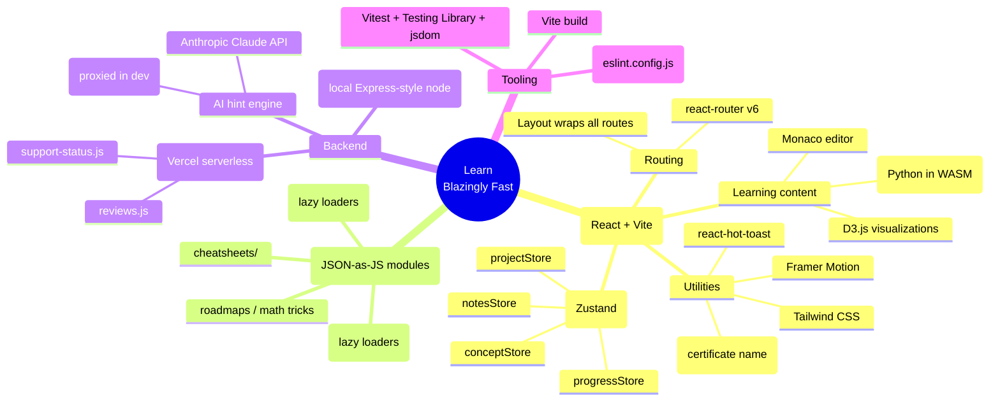
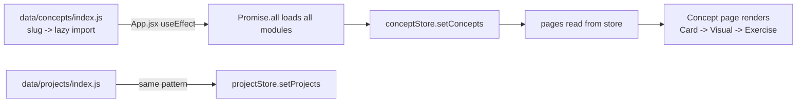

# 🧠 Learn Blazingly Fast — Architecture Mindmap

> A fast-acquisition learning platform for developers: 200+ DSA & ML concepts,
> each graspable in <5 min via a fixed 3-step loop **Card → Visual → Exercise**.
> Live at **learnblazinglyfast.tech**.

_Last updated: 2026-09-02. Keep this in sync when routes, stores, or the data pipeline change._

## At a glance



## Directory map (annotated)

```
Learning-Platform/
├── src/
│   ├── App.jsx                 # Router + boot: lazy-loads all concepts & projects into stores on mount
│   ├── main.jsx                # React root
│   ├── pages/                  # One component per route (Home, Concept, Browse, Review, Playground,
│   │                           #   Projects, Project, Testimonials, Certificates, Notes, Leaderboard,
│   │                           #   Roadmaps, Roadmap, CheatSheets, CheatSheet, MathTricks, MathTrick)
│   ├── components/ui/          # Layout.jsx (route shell), NameModal.jsx, shared UI
│   ├── store/                  # Zustand stores (see below)
│   ├── data/
│   │   ├── concepts/index.js   # map of slug -> () => import(...)  (lazy)
│   │   ├── projects/index.js   # same shape for projects
│   │   └── cheatsheets/        # bash.js, typescript.js, api-security.js, ...
│   ├── utils/
│   │   ├── algorithms/         # graphAlgorithms.js, searchAlgorithms.js, sorting.js  (+ .test.js)
│   │   ├── complexity.js       # (+ complexity.test.js)
│   │   └── dailyConcept.js     # deterministic "concept of the day" (+ dailyConcept.test.js)
│   └── test/setup.js           # Vitest global setup (localStorage/sessionStorage polyfill)
├── server/index.js             # Local dev API server
├── api/                        # Vercel serverless functions (reviews, support-status)
├── scripts/                    # validate_concepts.js, one-off fix_*.js data migrations
├── vite.config.js              # Vite + Vitest config + /api/hint dev proxy
├── eslint.config.js            # Flat ESLint config (NEW)
└── PROMPT.md.md                # Original product/build spec
```

## State stores (Zustand)

| Store | Responsibility |
|---|---|
| `conceptStore` | All concepts (populated by `App.jsx` on boot), current concept, progress hooks |
| `projectStore` | All projects (populated by `App.jsx` on boot) |
| `progressStore` | User progress / completion tracking (localStorage-persisted) |
| `notesStore` | User notes |
| `learnerName` util | Certificate name (localStorage, replaces `authStore` which was removed) |

## Data flow — how content reaches the screen



## Routes (from `src/App.jsx`)

`/` · `/concept/:slug` · `/browse` · `/projects` · `/project/:slug` · `/review` ·
`/playground` · `/testimonials` · `/certificates` · `/notes` · `/leaderboard` ·
`/roadmaps` · `/roadmaps/:slug` · `/cheatsheets` · `/cheatsheets/:id` ·
`/math` · `/math/:slug` — all nested inside `<Layout />`.
