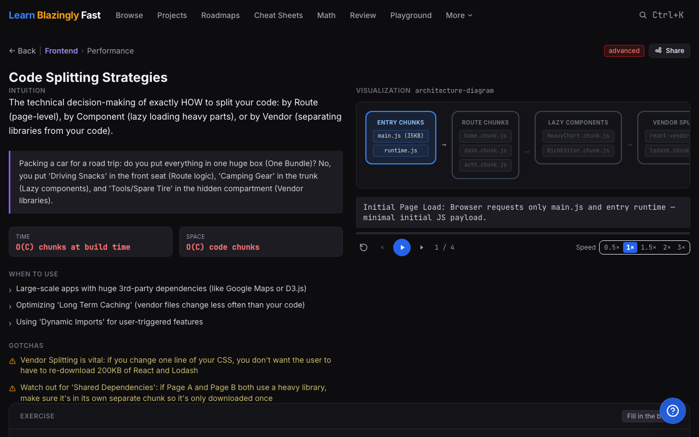
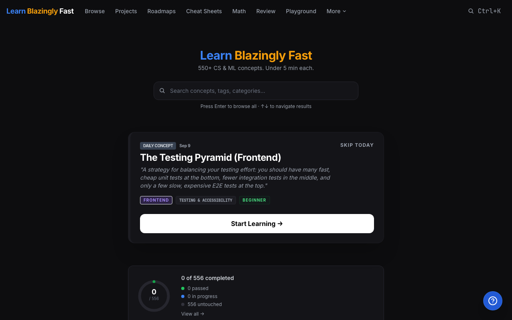

# Learn Blazingly Fast ⚡️

<div align="center">

[](https://learnblazinglyfast.tech)
[](https://react.dev)
[](https://vitejs.dev)
[](https://tailwindcss.com)
[](https://vitest.dev)
[](LICENSE)

**550+ Computer Science, Machine Learning, and Software Engineering Concepts Visualized.**  
*Interactive simulations, step-by-step algorithms, and hands-on coding exercises. Under 5 minutes each.*

[Explore the Platform](https://learnblazinglyfast.tech) • [Browse Concepts](https://learnblazinglyfast.tech/browse) • [Career Roadmaps](https://learnblazinglyfast.tech/roadmaps) • [Contribute](#-contributing)

</div>

---

## 📸 Preview

<div align="center">

### Interactive Concept Visualizations


### Platform Dashboard & Daily Challenges


</div>

---

## ⚡️ What is Learn Blazingly Fast?

**Learn Blazingly Fast** is an open-source educational platform designed to build intuitive mental models for complex technical concepts. Rather than reading dense walls of documentation or passively watching videos, developers learn through **real-time stepping, interactive state machines, visual architecture diagrams, and live in-browser coding exercises**.

---

## 🌟 Key Features

- 🧠 **550+ Visual Concepts**: Covering Data Structures & Algorithms, Machine Learning, AI Systems, Frontend Internals, Backend Architecture, System Design, and Business Logic.
- 🕹️ **14 Specialized Visualization Engines**:
  - **Architecture Diagrams**: Multi-tier system topologies, module bundler graphs, critical rendering paths.
  - **State Machines**: Circuit breakers, React lifecycles, Service Workers, event loops, TDD cycles.
  - **Tree & Graph Canvases**: AVL rebalancing, BST operations, BFS/DFS, LCA, centroid decomposition.
  - **Machine Learning Visualizers**: Loss landscapes, gradient descent step-downs, cluster plots, vector embeddings.
  - **Dynamic Matrix Grids**: 2D dynamic programming tables, convolution kernels, attention heatmaps.
  - **Timeline Steps**: Blue-green rollouts, database cache flows, neural net backpropagation.
- ⏯️ **Interactive Step-by-Step Playback**: Scrub backward/forward through algorithmic executions, change speeds (0.5× to 3×), and inspect intermediate state annotations.
- 💻 **In-Browser Code Exercises**: Write and test Python (via WebAssembly Pyodide) and JavaScript directly in Monaco Editor without local environment setup.
- 🗺️ **Guided Career Roadmaps**: Curated learning paths for Frontend Engineers, Backend Architects, ML Practitioners, and DevOps Specialists.
- 📑 **Fast Syntax Cheat Sheets**: Quick-reference syntax and idiomatic patterns for Python, JavaScript, TypeScript, SQL, and Docker.
- 📱 **Mobile-First Responsiveness**: Tailored mobile touch layouts, gesture-friendly scrolling, and compact playback controls.
- 📸 **Rich Social Sharing**: 1-click share card generation with automatic clipboard image copying for Twitter/X and native OS share sheets.

---

## 🛠️ Tech Stack

| Layer | Technology |
| :--- | :--- |
| **Framework** | [React 18](https://react.dev/) + [Vite](https://vitejs.dev/) |
| **Routing** | [React Router v7](https://reactrouter.com/) |
| **Styling** | [Tailwind CSS](https://tailwindcss.com/) + Custom Glassmorphism Design System |
| **Animations** | [Framer Motion](https://www.framer.com/motion/) |
| **Code Editor** | [Monaco Editor](https://microsoft.github.io/monaco-editor/) |
| **In-Browser Python** | [Pyodide](https://pyodide.org/) (WebAssembly) |
| **State Management** | [Zustand](https://zustand-demo.pmnd.rs/) with LocalStorage persistence |
| **Card Generation** | [html2canvas](https://html2canvas.hertzen.com/) |
| **Unit Testing** | [Vitest](https://vitest.dev/) (66 automated tests) |
| **Deployment** | [Vercel](https://vercel.com/) |

---

## 🚀 Getting Started

Follow these steps to run the platform locally on your machine:

### 1. Clone the repository

```bash
git clone https://github.com/EmmanuelEkundayo/Learning-Platform.git
cd Learning-Platform
```

### 2. Install dependencies

```bash
npm install
```

### 3. Launch the development server

```bash
npm run dev
```

Open [http://localhost:5173](http://localhost:5173) in your browser to start exploring.

### 4. Run tests & production build

```bash
# Run unit tests
npm test

# Build for production
npm run build
```

---

## 📂 Project Structure

```text
Learning-Platform/
├── src/
│   ├── components/
│   │   ├── visualizations/   # 14 custom visual simulation engines
│   │   ├── exercises/        # Interactive coding challenges
│   │   └── ui/               # Reusable UI components & layouts
│   ├── data/
│   │   ├── concepts/         # 550+ individual concept JSON definitions
│   │   ├── cheatsheets/      # Language & tooling cheat sheets
│   │   └── roadmaps/         # Career path curriculums
│   ├── store/                # Zustand client stores
│   ├── utils/                # Pyodide runtime, SEO helpers, share cards
│   └── pages/                # Route views (Home, Browse, Concept, etc.)
├── public/                   # Static icons, favicons, OG preview cards
└── docs/                     # Documentation images and previews
```

---

## 🤝 Contributing

We welcome contributions of all kinds! Whether you want to add new concept visualizations, write cheat sheets, improve performance, or fix bugs, your help is appreciated.

### Good First Issues
Check out beginner-friendly issues tagged with **[`good first issue`](https://github.com/EmmanuelEkundayo/Learning-Platform/labels/good%20first%20issue)**:
- [#1: Add interactive visual simulation for Dijkstra's Algorithm](https://github.com/EmmanuelEkundayo/Learning-Platform/issues/1)
- [#2: Create syntax and concurrency cheat sheet for Go and Rust](https://github.com/EmmanuelEkundayo/Learning-Platform/issues/2)
- [#3: Optimize mobile touch responsiveness on Canvas visualizations](https://github.com/EmmanuelEkundayo/Learning-Platform/issues/3)
- [#4: Add interactive visualization for A* Search pathfinding on 2D grid](https://github.com/EmmanuelEkundayo/Learning-Platform/issues/4)

Please read our **[CONTRIBUTING.md](CONTRIBUTING.md)** guide for instructions on local setup, schema specifications, and pull request guidelines.

---

## 📄 License

This project is licensed under the **MIT License** — see the [LICENSE](LICENSE) file for details.

---

<div align="center">

Built with ❤️ by [Emma](https://twitter.com/ekunday00) • Live at **[learnblazinglyfast.tech](https://learnblazinglyfast.tech)**

</div>
